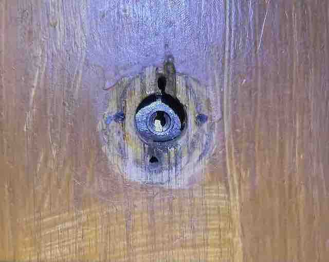

# BIM004Home

This repo is for project BIM004Home, a SmartHome Hub designed for my dorm room. 

As of now, it only includes a fingerprint lock modified based on BIM001Print. More devices to come in the future!

## Major improvements from BIM001
The new dorm came with a much older (and less automatic) door than the East House door. While the East house door opens and closes (plus locks) by simplying pulling the door handle, the Wannamaker door uses the traditional design of a door knob.

Thus, the unlocking mechanism of our fingerprint lock needs to be redesigned. Here I chose to remove the door knob entirely and design a component that binds the servo motor with the key hole. 

When the servo is mounted onto the door, our 3d-printed servo arm turns the lock using two forces: 1. the turning force at the end 2. the friction between two flat surfaces.

Since now the original lock is covered with our lock box, a toggle switch is used to open/lock the door from the inside.

State of the lock is now color-coded. Purple - locked. Grey - open. Blue - finger match. Red - no finger.

The other major improvement from BIM001 is that no superglue is used in BIM004! All connections are secured using screws. 

